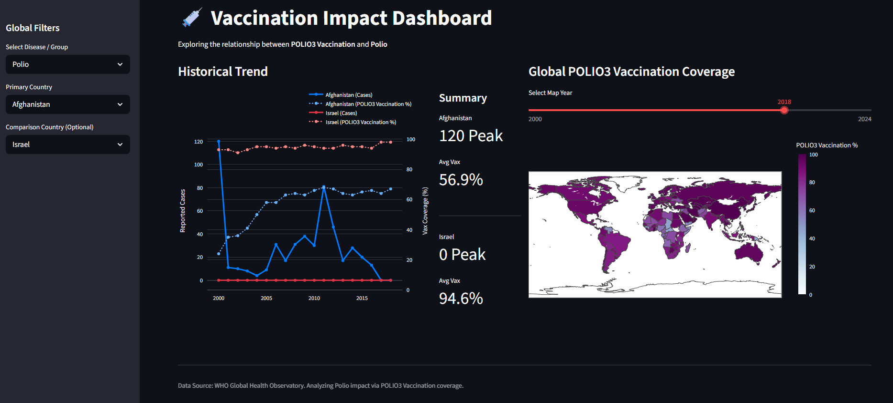
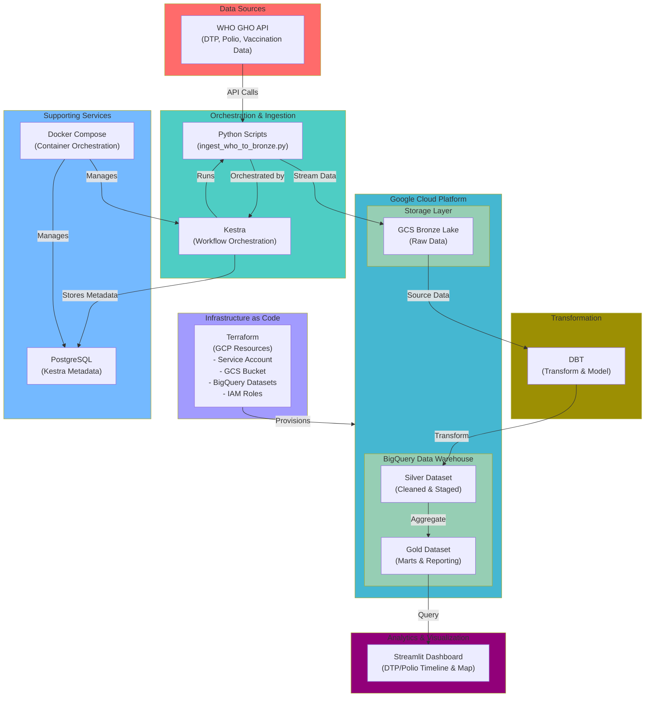

# WHO-VPD-Pipeline
An ETL pipeline for the WHO GHO OData API. Automates extraction of fragmented disease incidence and vaccination records (DTP/Polio 3).

## Problem Description

**Global health surveillance data is fragmented and difficult to access.** The World Health Organization (WHO) collects vast amounts of epidemiological and immunization data through its Global Health Observatory (GHO), but this data is scattered across multiple APIs and formats, making it challenging for researchers, health officials, and analysts to:

1. **Track vaccination coverage trends**: Understanding DTP (Diphtheria-Tetanus-Pertussis) and Polio 3 vaccination coverage across countries and over time requires aggregating data from disparate sources.

2. **Correlate vaccination with disease incidence**: Analyzing the relationship between vaccination rates and actual disease incidence across countries is critical for evaluating public health interventions, but requires manual data collection and merging.

3. **Enable comparative analysis**: Comparing vaccination and disease trends between countries is time-consuming and error-prone without a unified, structured data platform.

4. **Access real-time actionable insights**: Public health decision-makers need accessible, up-to-date dashboards that combine multiple data dimensions (temporal, geographic, clinical) in one place.

This project addresses these challenges by **automating the extraction, transformation, and visualization of WHO vaccination and disease incidence data**, creating a unified analytics platform for global health surveillance.


# Dashboard

The result of this project is a dashboard showing the timeline of DTP and Polio cases per Country, as well as a Vaccination coverage map.
It is possible to show two countries in the timeline.
The map shows the vaccination state for one selectable year.



## Architecture



# Usage Instructions
OS:
- The setup was tested on WSL2 with Ubuntu 24.04.
- It should work on MacOS and most Debian based Linux distros.
- Windows will likely require some reconfiguration.

Required tools:
- make
- Python3.12
- docker-compose
- google cloud-cli (see instructions below)
- terraform (see instructions below)

The project works based on a Makefile which allows easy execution of all required steps.

## Google Cloud

- Create a Project: Log into the [GCP Console](https://console.cloud.google.com/) and create a new project (tested with **No Organization**). Note your Project ID.
- Enable Billing: Ensure billing is attached to the project (required for BigQuery and Dataproc APIs).

## Environment Variables
Set your environment variables:

Note: you only need to add your project id (and optionally change the region)
``` bash
export GCP_PROJECT_ID=your-project-id
export GCP_REGION=us-central1
export BUCKET_NAME=who_bronze_lake_$GCP_PROJECT_ID
```

## Install and authenticate Google Cloud (interactive):
``` bash
make install-gcloud
# Restart your shell or run: source ~/.bashrc
make login-gcloud
```

## Install Terraform
- [Install Terraform CLI](https://developer.hashicorp.com/terraform/tutorials/aws-get-started/install-cli)

## Run the setup
``` bash
make setup
```

## Run ingestion flow in kestra 
- Open Kestra on localhost:8080
- Run flow data-ingestion

## Run dbt to transform the data
``` bash
make transform
```

## Start the Streamlit app
``` bash
make view
```

# 🛡️ Data Ethics & Compliance
## Sensitive Data & Privacy

This project adheres to high standards of data privacy and ethical engineering practices:

- No PII: This pipeline only processes anonymized, aggregated global health data at the country and regional levels. No Personally Identifiable Information (PII) is accessed, stored, or processed.
- Source Integrity: Data is fetched directly from the official WHO GHO OData API to ensure data lineage and integrity.

## Data Use Disclaimer

- **WHO-DATA**: All epidemiological and immunization data are provided by the World Health Organization (World Health Organization).
    - License: This data is used under the Creative Commons Attribution-NonCommercial-ShareAlike 3.0 Intergovernmental Organization (CC BY-NC-SA 3.0 IGO) license.
    - Non-Endorsement: This repository is an independent data engineering project for analytical and educational purposes. It is not an official WHO product, and the findings do not represent the official views of the WHO.
    - Terms: Use of the data is subject to the [WHO Data Use Agreement](https://www.who.int/about/policies/publishing/copyright).
- **ISO-3166 Country Codes**: Provided by [lukes/ISO-3166-Countries-with-Regional-Codes](https://github.com/lukes/ISO-3166-Countries-with-Regional-Codes).
  - **License**: [Creative Commons Attribution 4.0 International](https://creativecommons.org/licenses/by/4.0/)
  - **Attribution**: Luke Duncalfe (2024).